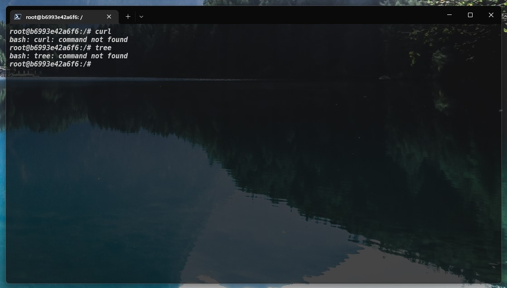
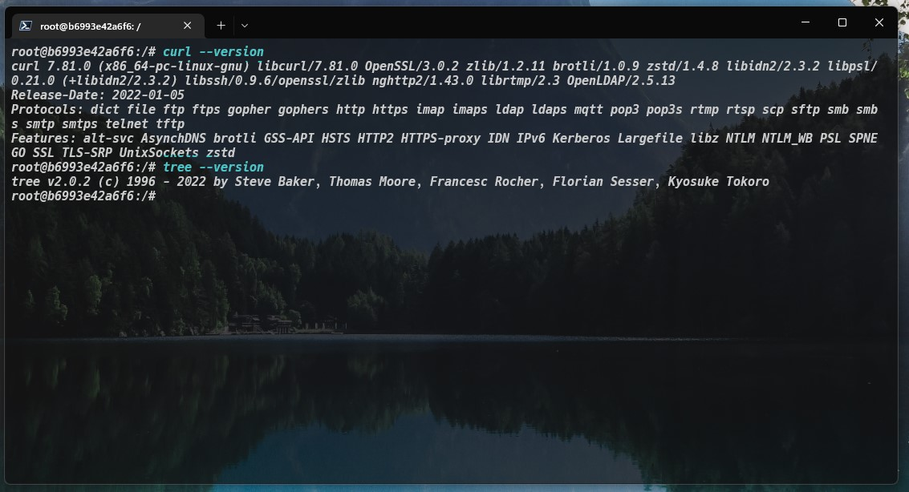

# LINUX - Podstawowe komendy & Praca na plikach

## Forma wykonania pracy domowej

Za wykonanie pracy domowej uznaje się uzupełnienie wskazanych pól w [instrukcji terminala](./instrukcja_terminala.md) (będącej pliku z rozszerzeniem [MARKDOWN](https://www.markdownguide.org/basic-syntax/); pola oznaczone `MIEJSCE_NA_ODPOWIEDŹ` - wpisując odp. między znacznikami) komendami potrzebnymi do uzyskania przedstawionego wyniku w terminalu (konsoli). Oczekiwany rezultat został przedstawiony w formie zrzutu ekranu.

Szablon należy uzupełnić pracując na wcześniej przygotowanej gałęzi (branch'u), zgodnie z zasadmi przedstawionymi w [głównym pliku README](../../README.md).

---

## Początkowa konfiguracja i "miejsce startu"

***UWAGA: konfiguracja opcjonalna - można pominąć gdy posiadamy narzędzia `curl` i `tree`***

Jako użytkownik znajduję się w katalogu głównym (w przykładzie jako root | u Was jako użytkownik w folderze domowym):

Sprawdzam dostępne narzędzia (command-line tool), tj. `curl` i `tree`, i otrzymuje następujące wiadomosci błędu:

W celu zainstalowania wykonuję komendy `apt install curl` oraz `apt install tree`, poprzedzając je komendą `apt update` (**uwaga jeśli nie jest się root'em będzie potrzeba dodania prze komendami `sudo`**). Po wykonaniu instalacji oczekuję wspomnianych narzędzi i mogę sprawdzić ich wersję:

---
## Punktacja

Do zdobycia jest :one::zero: pkt.  
Zadanie oddane po terminie oceniane jest na maksymalnie połowę punktów.

#### Powodzenia!

---
### :clock12: Termin oddania:
## Sobota, 31.12.2022 godz. 23:59
