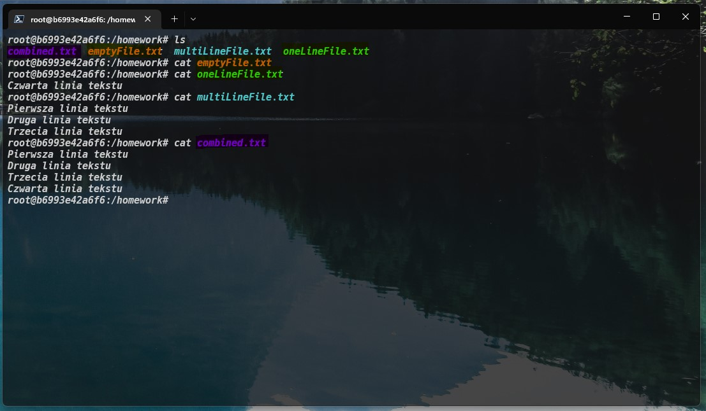

# Linux - Praca z terminalem

**UWAGA: W ramach pracy domowej z LINUX'a proszę o edycję wyłącznie tego pliku**

---

Będąc w katalogu domowym:

---
## Przykład 1

Aby wylistować zawartość katalogu (wraz z plikami/folderami ukrytymi) powinienem użyć komendy `ls -lt`, a wynik jest następujący:

Niestety, rozmiar plików i katalogów nie jest dla nas czytelny więc aktualizujemy komendę `ls -l -h`, aby uzyskać:

---

## Przykład 2

Jako prowadzacy, mając trzech studentów, dla których przygotuję po trzy zadania, z pytaniami i odpowiedziami, chciałbym przygotować odpowiednią strukturę folderów. Aby to wykonać wykonuję komendę `tree`, aby otrzymać następujący wynik:

Przechodząc z folderu `/` do folderu `/homework/student2/task3/question` wykonuję polecenie `cd /homework/student2/task3/question`, a chcąc powrócić do poprzedniego folderu (nie folderu wyżej) wykonuję `cd -`, uzyskując:

W celu usunięcia całości za jednym razem wykorzystam polecenie `rm -rf homework`

---

## Przykład 3

W folderze `homework` chciałbym stworzyć pliki:

- **emptyFile.txt** (pusty plik) i do tego użyję polecenia `touch emptyFile.txt`
- **oneLineFile.txt** (plik z jedną linijką tekstu) i do tego użyję polecenia `echo "Hallo World" >oneLineFile.txt`
- **multiLineFile.txt** (plik z 3 liniami tekstu) i do tego użyję polecenia `echo -e " First line \n Sekund line \n lastone line " > multiLineFile.txt 
`
- **combined.txt** (plik powstały z połączenia pliku **multiLineFile.txt** i **oneLineFile.txt**) i do tego użyję polecenia `cat multiLineFile.txt oneLineFile.txt > combined.txt`

A całość prezentuje się jak poniżej:

---

## Przykład 4

Chciałbym pobrać poeamt Adama Mickiewicza "Pan Taduesz" w wersji txt ze strony - [link](https://wolnelektury.pl/media/book/txt/pan-tadeusz.txt) i zapisać jego zawartość w pliku TXT o nazwie `pan-tadeusz.txt` (czyli takiej samej jak plik na serwerze). Aby wykonać dane polecenie użyję `curl https://wolnelektury.pl/media/book/txt/pan-tadeusz.txt -o pan-tadeusz.txt`.

Będąc zainteresowany jaki ISBN ma poeamt przeszukuję plik używając polecenia `grep "ISBN" pan-tadeusz.txt`. Zadowolony z otrzymanego wyniku, chciałbym dodatkowo sprawdzić w których linijkach (o jakim numerze) występuje szukany ISBN więc wykonuję `grep -n "ISBN" pan-tadeusz.txt`. Na koniec z ciekawości chciałbym odpalić komendę `grep -c "ISBN" pan-tadeusz.txt`, aby uzyskać jedynie sumę wszsytkich wystąpień ISBN w pliku.

Powyższe kroki uwiecznione zostały poniżej (w pierwszej linii widać, że plik już istnieje i jest na naszym dysku):

---

## Przykład 5

Pracując w terminalu, wprowadzając jakiekolwiek polecenia, z kursorem we wskazanym miejscu:

Chcąc usunąć całość tekstu po lewej użyję skrótu klawiszowego `ctrl + u`, uzyskując:

Chcąc usunąć całość tekstu po prawej użyję skrótu klawiszowego `ctrl + k`, uzyskując:

Wykorzystując początkową wartość ("one two three four five six")...

Chcąc usunąć jedno słowo po lewej użyję skrótu klawiszowego `left alt + backspace`, uzyskując:

Chcąc usunąć jedno slowo po prawej użyję skrótu klawiszowego `ctrl + delete`, uzyskując:

